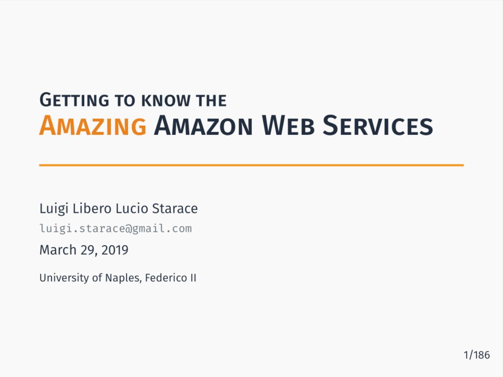

# Getting to know Amazon Web Services
An introduction to Amazon Web Services with two tutorials: a simple deployment of a web app with ElasticBeanstalk and a serverless React web app with Lambda functions!

## Tutorial materials
The slides feature a very detailed walkthrough. You'll find the necessary materials in the following two repos:
* [serverful-webapp](https://github.com/luistar/serverful-webapp);
* [serverless-webapp](https://github.com/luistar/serverless-webapp).

## Template
The beamer template used in this slides is [Metropolis](https://github.com/matze/mtheme).
